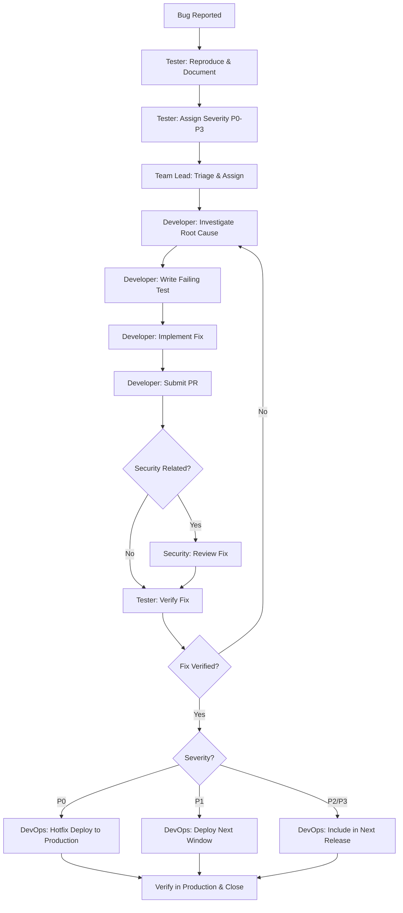

# Bug Fix Workflow

Structured process for triaging, fixing, and deploying bug fixes with severity-based SLAs.

---

## Severity Classification

| Severity | Description | Examples | SLA: Response | SLA: Resolution |
|----------|-------------|----------|---------------|-----------------|
| **P0 - Critical** | System down or data loss. Affects all users or core revenue path. | Payment processing broken, authentication failure for all users, data corruption | 15 minutes | 4 hours |
| **P1 - High** | Major feature broken. Significant user impact with no workaround. | Search returns no results, file uploads fail, notifications not delivered | 1 hour | 24 hours |
| **P2 - Medium** | Feature degraded. Users are impacted but a workaround exists. | Slow page load on specific browser, incorrect sorting, UI misalignment on mobile | 4 hours | 3 business days |
| **P3 - Low** | Minor issue. Cosmetic or edge case with minimal user impact. | Typo in UI text, tooltip mispositioned, rare edge case in date formatting | 1 business day | Next sprint |

> **Response** = time to acknowledge and begin investigation. **Resolution** = time to deploy the fix to production.

---

## Workflow Steps

### Step 1: Reproduce and Document

**Agent:** Tester

- Reproduce the bug in a controlled environment (staging or local).
- Document the bug report with:
  - Steps to reproduce (numbered, specific).
  - Expected behavior vs. actual behavior.
  - Environment details (browser, OS, API version, device).
  - Screenshots, logs, or error messages.
  - Affected users/scope estimate.
- Assign severity (P0-P3) based on the classification table above.
- File the bug in the issue tracker with all details.

### Step 2: Triage and Assign

**Agent:** Team Lead

- Review the bug report for completeness and severity accuracy.
- Adjust severity if needed based on broader context (affected user count, business impact).
- Assign to the appropriate developer based on:
  - Code ownership and domain expertise.
  - Current workload and availability.
  - For P0: assign immediately and notify via direct message.
- For P0/P1: create a dedicated communication channel if coordination is needed.

### Step 3: Fix and Test

**Agent:** Developer (Backend Dev, Frontend Dev, or Mobile Dev)

- Investigate root cause. Document findings in the issue.
- Write a failing test that reproduces the bug.
- Implement the fix.
- Verify the failing test now passes.
- Run the full related test suite to check for regressions.
- Submit a pull request with:
  - Link to the bug report.
  - Root cause explanation.
  - Description of the fix.
  - Test coverage for the fix.

### Step 4: Security Review (Conditional)

**Agent:** Security

Triggered when any of the following apply:
- The bug involves authentication or authorization.
- The bug exposes user data or PII.
- The bug is in input validation or output encoding.
- The bug is in a dependency with a known CVE.
- The fix modifies security-sensitive code paths.

Security review includes:
- Verify the fix addresses the root cause (not just the symptom).
- Check for related vulnerabilities in adjacent code.
- Confirm no new attack surface is introduced.
- For CVE-related fixes, verify the patch version is correct.

### Step 5: Verify Fix

**Agent:** Tester

- Pull the fix branch or deploy to a test environment.
- Re-execute the original reproduction steps; confirm the bug is resolved.
- Run regression tests on related functionality.
- Test edge cases around the fix.
- For P0/P1: verify in a staging environment that matches production configuration.
- Mark the bug as verified and approve the pull request.

### Step 6: Deploy

**Agent:** DevOps

- For **P0**: Deploy as a hotfix directly to production following the hotfix process (see release.md). Skip the regular release cycle.
- For **P1**: Deploy in the next available release window (same day or next business day).
- For **P2/P3**: Include in the next scheduled release.

Deployment steps:
1. Merge the approved pull request.
2. Build and package the release artifact.
3. Deploy to staging and run smoke tests.
4. Deploy to production.
5. Verify the fix in production.
6. Close the bug report.

---

## Workflow Diagram

---

## SLA Escalation

If an SLA is at risk of being breached:

| Time Remaining | Action |
|---------------|--------|
| 50% of SLA elapsed | Team Lead notified. Ensure resources are allocated. |
| 75% of SLA elapsed | Engineering Manager notified. Consider pairing or reassignment. |
| 90% of SLA elapsed | VP Engineering notified. All-hands support if P0. |
| SLA breached | Incident logged. Post-mortem required for P0/P1 breaches. |

---

## P0 Fast Track

For critical production incidents, the standard workflow is compressed:

1. **Tester** reproduces and documents (15 min max).
2. **Team Lead** assigns immediately via direct notification.
3. **Developer** investigates and fixes. Pair programming encouraged.
4. **Security** performs expedited review (concurrent with testing if needed).
5. **Tester** verifies on staging.
6. **DevOps** deploys hotfix to production.
7. Post-incident review within 48 hours.

All communication happens in a dedicated incident channel. Status updates every 30 minutes until resolved.
