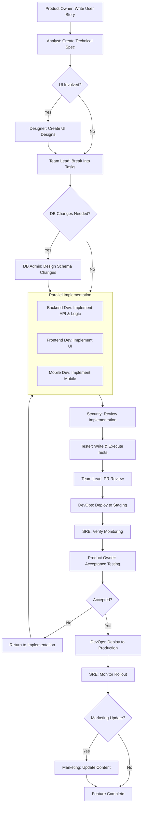

# Feature Lifecycle Workflow

Complete feature development workflow from user story to production deployment.

## Overview

This workflow covers every phase of delivering a new feature, from initial requirements through production release. It defines which agent owns each step, where parallel work is possible, and the quality gates that must pass before moving forward.

---

## Workflow Phases

### Phase 1: Requirements and Specification

| Step | Agent | Description |
|------|-------|-------------|
| 1.1 | **Product Owner** | Write user story with acceptance criteria in standard format ("As a... I want... So that..."). Define business value, priority, and target release. |
| 1.2 | **Analyst** | Create technical specification from the user story. Document API contracts, data flows, integration points, edge cases, and non-functional requirements. |
| 1.3 | **Designer** | Create UI designs, wireframes, and interaction flows (if UI is involved). Deliver design assets and component specifications. |

**Quality Gate QG-1: Specification Review**
- [ ] User story has clear acceptance criteria
- [ ] Technical spec is reviewed and approved by Team Lead
- [ ] UI designs reviewed by Product Owner and Frontend Dev
- [ ] Security implications identified and documented
- [ ] Estimated effort approved by stakeholders

---

### Phase 2: Planning and Design

| Step | Agent | Description |
|------|-------|-------------|
| 2.1 | **Team Lead** | Break the technical specification into discrete development tasks. Assign tasks to developers. Define dependencies and ordering. |
| 2.2 | **DB Admin** | Design schema changes, migration scripts, and data backfill plans (if database changes are needed). |

**Quality Gate QG-2: Implementation Readiness**
- [ ] All tasks created with clear descriptions and acceptance criteria
- [ ] Schema changes reviewed for performance impact and backward compatibility
- [ ] Migration rollback scripts prepared
- [ ] Dependencies between tasks are documented

---

### Phase 3: Implementation (Parallel)

These three streams run in parallel. Each developer works against the agreed API contracts and interfaces from the technical spec.

| Step | Agent | Description |
|------|-------|-------------|
| 3.1 | **Backend Dev** | Implement server-side logic, API endpoints, business rules, and data access layer. Write unit tests. |
| 3.2 | **Frontend Dev** | Implement UI components, state management, API integration, and client-side validation. Write unit tests. |
| 3.3 | **Mobile Dev** | Implement mobile screens, navigation, native integrations, and offline handling. Write unit tests. |

> All three streams target the same API contract. Backend Dev provides mock responses early so Frontend and Mobile can integrate without waiting.

**Quality Gate QG-3: Implementation Complete**
- [ ] All unit tests pass with adequate coverage (minimum 80%)
- [ ] Code follows project style guide and linting rules
- [ ] API contract matches the technical specification
- [ ] No critical or high-severity static analysis findings

---

### Phase 4: Review and Verification

| Step | Agent | Description |
|------|-------|-------------|
| 4.1 | **Security** | Review implementation for vulnerabilities: injection, authentication/authorization flaws, data exposure, dependency risks. |
| 4.2 | **Tester** | Write integration and end-to-end test cases from acceptance criteria. Execute tests. Report defects. |
| 4.3 | **Team Lead** | Review pull requests for code quality, architecture alignment, maintainability, and test coverage. |

**Quality Gate QG-4: Review Approval**
- [ ] Security review passed with no critical or high findings
- [ ] All test cases pass
- [ ] PR approved by Team Lead
- [ ] No unresolved review comments

---

### Phase 5: Staging and Acceptance

| Step | Agent | Description |
|------|-------|-------------|
| 5.1 | **DevOps** | Deploy to staging environment. Run smoke tests. Verify infrastructure configuration. |
| 5.2 | **SRE** | Verify monitoring coverage: dashboards, alerts, log aggregation, and SLO definitions for the new feature. |
| 5.3 | **Product Owner** | Perform acceptance testing against the original user story criteria in the staging environment. |

**Quality Gate QG-5: Release Readiness**
- [ ] Staging deployment is stable and functional
- [ ] Monitoring and alerting are in place
- [ ] All acceptance criteria met and signed off by Product Owner
- [ ] Performance benchmarks within acceptable thresholds

---

### Phase 6: Production Release

| Step | Agent | Description |
|------|-------|-------------|
| 6.1 | **DevOps** | Deploy to production using the approved release process (blue-green, canary, or rolling). |
| 6.2 | **SRE** | Monitor rollout metrics, error rates, latency, and resource usage. Confirm SLOs are met. |
| 6.3 | **Marketing** | Update public-facing content: release notes, documentation, blog posts, in-app messaging (if needed). |

---

## Workflow Diagram

---

## Example Task Breakdown

**User Story:** "As a customer, I want to receive email notifications when my order ships so that I can track my delivery."

| Task | Agent | Estimate | Dependencies |
|------|-------|----------|--------------|
| Design notification preferences schema | DB Admin | 2h | Spec approved |
| Create email template for shipping notification | Frontend Dev | 4h | UI design approved |
| Implement shipment event listener | Backend Dev | 4h | Schema migration applied |
| Build notification preferences API | Backend Dev | 3h | Schema migration applied |
| Build notification preferences UI | Frontend Dev | 4h | API contract defined |
| Build mobile notification preferences screen | Mobile Dev | 4h | API contract defined |
| Integrate with email delivery service | Backend Dev | 3h | Event listener complete |
| Write integration tests | Tester | 4h | API endpoints complete |
| Security review of PII handling in emails | Security | 2h | Implementation complete |
| Deploy and configure staging email sandbox | DevOps | 2h | All code merged |

**Parallel tracks:**
- Backend Dev works on event listener and API while Frontend Dev builds the email template.
- Frontend Dev and Mobile Dev build preferences UI in parallel once the API contract is defined.

---

## Rollback Plan

Every production deployment must have a documented rollback procedure.

### Pre-Deployment

1. Tag the current production release as the rollback target.
2. Ensure database migrations have a corresponding reverse migration.
3. Verify that the previous deployment artifact is available and deployable.
4. Confirm feature flags are in place for gradual rollout (when applicable).

### Rollback Triggers

Initiate rollback if any of the following occur within the monitoring window (first 30 minutes):
- Error rate exceeds 2x the pre-deployment baseline.
- P95 latency exceeds the defined SLO threshold.
- Critical functionality is broken (payment, authentication, core workflows).
- Data corruption or loss is detected.

### Rollback Steps

| Step | Agent | Action |
|------|-------|--------|
| 1 | **SRE** | Detect anomaly and raise rollback alert. |
| 2 | **Team Lead** | Approve rollback decision. |
| 3 | **DevOps** | Revert deployment to the tagged previous release. |
| 4 | **DB Admin** | Execute reverse migration if schema changes were applied (only if safe; if data was written to new columns, coordinate with Backend Dev). |
| 5 | **SRE** | Verify system stability after rollback. |
| 6 | **Team Lead** | Conduct incident review. Create follow-up tasks for the failed release. |

### Post-Rollback

- The feature branch remains intact for rework.
- A post-mortem is conducted within 48 hours.
- Root cause is documented and linked to the original user story.
- The feature re-enters the workflow at the appropriate phase (usually Phase 3 or Phase 4).
