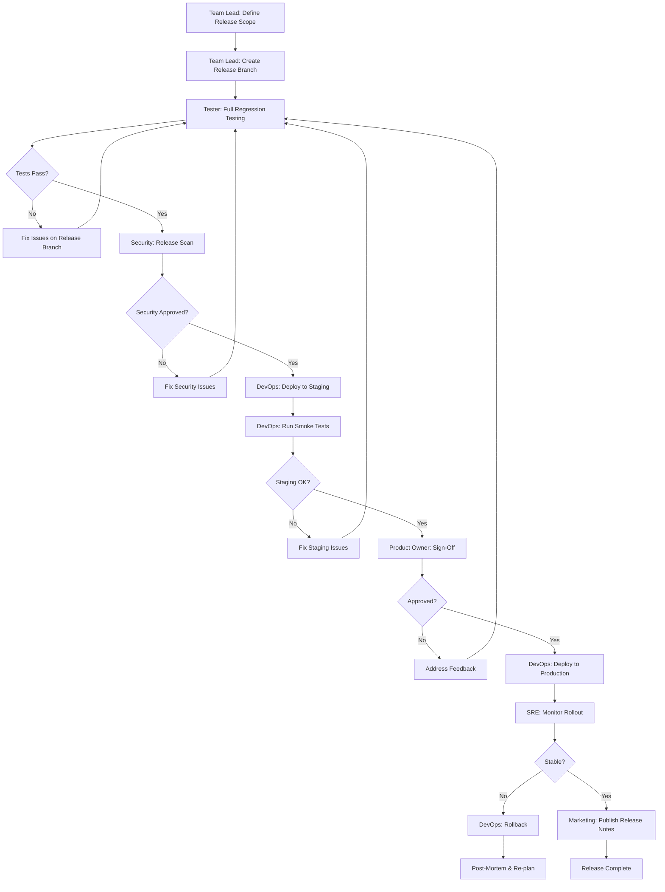
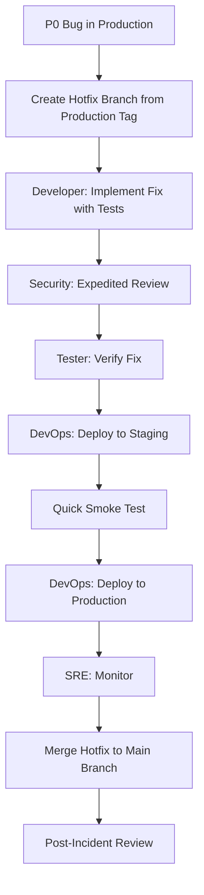

# Release Workflow

Coordinated process for planning, validating, and deploying releases to production.

---

## Versioning Strategy

This project follows [Semantic Versioning (SemVer)](https://semver.org/): **MAJOR.MINOR.PATCH**

| Component | When to Increment | Example |
|-----------|-------------------|---------|
| **MAJOR** | Breaking changes to public APIs, data model incompatibilities, removal of deprecated features | 1.0.0 -> 2.0.0 |
| **MINOR** | New features, non-breaking additions, significant enhancements | 1.2.0 -> 1.3.0 |
| **PATCH** | Bug fixes, security patches, minor corrections | 1.3.1 -> 1.3.2 |

### Pre-release Labels

- Release candidates: `1.4.0-rc.1`, `1.4.0-rc.2`
- Beta builds: `1.4.0-beta.1`

### Tagging Convention

- Git tags: `v1.4.0`
- Release branches: `release/1.4.0`
- Hotfix branches: `hotfix/1.3.3`

---

## Workflow Steps

### Step 1: Coordinate Release Scope

**Agent:** Team Lead

- Define the features and fixes included in this release.
- Review all merged pull requests since the last release.
- Confirm all included items have passed their respective workflows (feature lifecycle or bug fix).
- Create a release branch from the main development branch.
- Update the version number according to SemVer rules.
- Draft the changelog from merged PR descriptions and commit history.

### Step 2: Full Regression Testing

**Agent:** Tester

- Execute the full regression test suite against the release branch.
- Run automated test suites: unit, integration, end-to-end.
- Perform manual exploratory testing on high-risk areas.
- Test backward compatibility if the release includes API changes.
- Test upgrade paths from the previous release version.
- Document all test results and any new issues found.
- All blocking issues must be resolved before proceeding.

### Step 3: Security Release Scan

**Agent:** Security

- Run dependency vulnerability scan (CVE check on all dependencies).
- Perform static application security testing (SAST).
- Review any new third-party integrations or dependencies added in this release.
- Verify that all security-related bug fixes are included.
- Check for exposed secrets or credentials in the codebase.
- Sign off on the release from a security perspective.

### Step 4: Deploy to Staging

**Agent:** DevOps

- Deploy the release candidate to the staging environment.
- Run automated smoke tests.
- Verify environment configuration matches production (feature flags, environment variables, service connections).
- Execute database migrations in staging.
- Perform load testing if the release includes performance-sensitive changes.
- Verify rollback procedure works in staging.

### Step 5: Product Owner Sign-Off

**Agent:** Product Owner

- Review all features and fixes in the staging environment.
- Verify features match the original requirements and acceptance criteria.
- Approve the release for production deployment.
- Confirm the changelog and release notes are accurate.
- Communicate the upcoming release to stakeholders.

### Step 6: Deploy to Production

**Agent:** DevOps

- Execute the production deployment using the approved strategy:
  - **Blue-green**: Switch traffic to the new version after health checks pass.
  - **Canary**: Route a small percentage of traffic to the new version, gradually increase.
  - **Rolling**: Update instances incrementally with health checks between each batch.
- Apply database migrations.
- Update feature flags as needed.
- Verify health checks and smoke tests pass in production.
- Tag the release in git: `git tag v<version>`.

### Step 7: Monitor Rollout

**Agent:** SRE

- Monitor key metrics during and after deployment:
  - Error rates (HTTP 5xx, application exceptions).
  - Response latency (P50, P95, P99).
  - Resource utilization (CPU, memory, connections).
  - Business metrics (conversion rates, transaction volume).
- Compare metrics against pre-deployment baselines.
- Maintain elevated monitoring for the first 2 hours post-deployment.
- Confirm all SLOs are met before reducing monitoring posture.
- Declare the release stable or initiate rollback.

### Step 8: Publish Release Notes

**Agent:** Marketing

- Publish external release notes (blog post, changelog page, in-app notification).
- Update public documentation with new features and changes.
- Notify customers of breaking changes (if MAJOR version bump).
- Update support team with known issues and new feature documentation.
- Coordinate any marketing campaigns tied to the release.

---

## Workflow Diagram

---

## Release Checklist

Use this checklist for every release. All items must be completed before deploying to production.

### Pre-Release

- [ ] Release branch created from main development branch
- [ ] Version number updated (package.json, build configs, etc.)
- [ ] Changelog drafted with all included changes
- [ ] All included PRs have been reviewed and approved
- [ ] Full regression test suite passes
- [ ] Security scan completed with no critical or high findings
- [ ] Database migration scripts tested (forward and rollback)
- [ ] API documentation updated for any endpoint changes
- [ ] Feature flags configured for gradual rollout (if applicable)
- [ ] Rollback procedure documented and tested in staging

### Deployment

- [ ] Staging deployment successful
- [ ] Smoke tests pass in staging
- [ ] Product Owner sign-off received
- [ ] Production deployment window communicated to the team
- [ ] On-call engineer identified and available
- [ ] Production deployment executed
- [ ] Health checks pass in production
- [ ] Smoke tests pass in production

### Post-Release

- [ ] SRE confirms metrics are stable (2-hour monitoring window)
- [ ] Git tag created for the release version
- [ ] Release notes published
- [ ] Support team notified of changes
- [ ] Release branch merged back to main development branch
- [ ] Retrospective scheduled (for MAJOR releases)

---

## Hotfix Process

For critical production issues that cannot wait for the next scheduled release.

### When to Use

- P0 bugs in production (see bug-fix.md for severity definitions).
- Security vulnerabilities with active exploitation risk.
- Data integrity issues affecting users.

### Hotfix Steps

1. **Create hotfix branch** from the latest production tag: `hotfix/<version>` (e.g., `hotfix/1.3.3`).
2. **Developer** implements the fix with a regression test. Keep the change minimal and focused.
3. **Security** performs an expedited review (especially if the issue is security-related).
4. **Tester** verifies the fix resolves the issue without introducing regressions.
5. **DevOps** deploys to staging, runs smoke tests, then deploys to production.
6. **SRE** monitors the hotfix rollout with the same criteria as a standard release.
7. **Merge** the hotfix branch back into the main development branch to prevent regression.
8. **Increment** the PATCH version (e.g., 1.3.2 -> 1.3.3).
9. **Conduct** a post-incident review within 48 hours.

### Hotfix Approval

Hotfixes follow an accelerated approval path:

| Standard Release | Hotfix |
|-----------------|--------|
| Full regression suite | Targeted test suite + smoke tests |
| Security full scan | Expedited security review |
| Product Owner sign-off | Team Lead approval (Product Owner notified) |
| Scheduled deployment window | Immediate deployment |
| 2-hour monitoring window | 1-hour monitoring window (minimum) |
